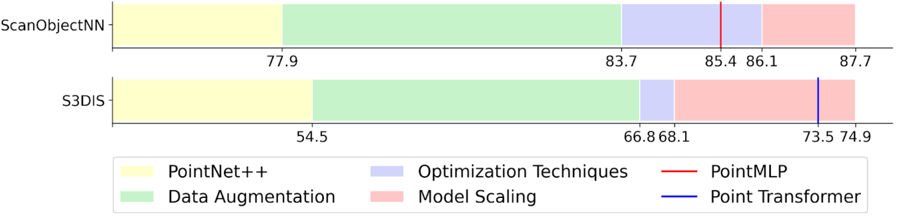
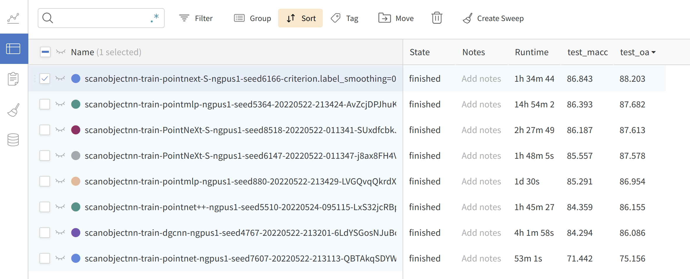
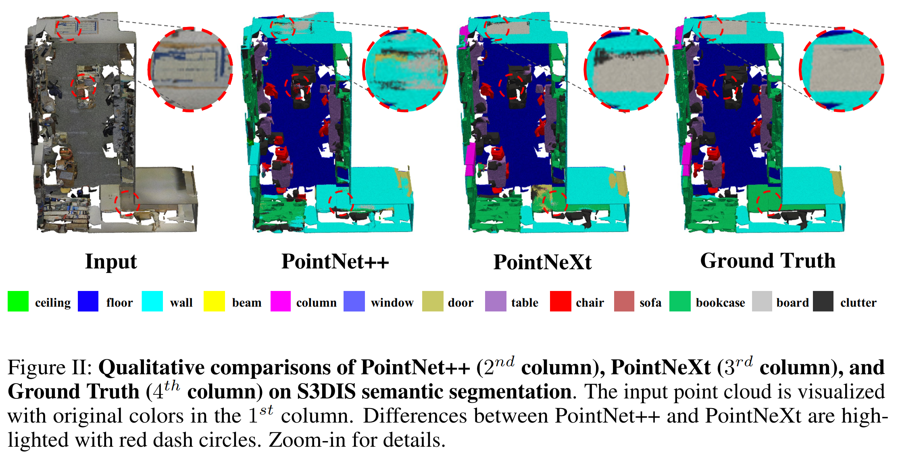
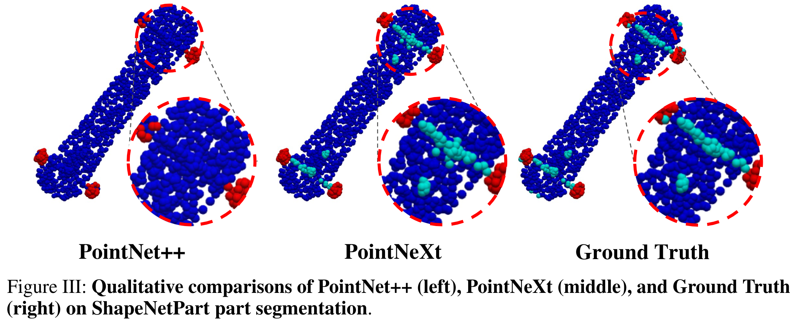

# PointNeXt
[](https://paperswithcode.com/sota/semantic-segmentation-on-s3dis?p=pointnext-revisiting-pointnet-with-improved)
[](https://paperswithcode.com/sota/3d-point-cloud-classification-on-scanobjectnn?p=pointnext-revisiting-pointnet-with-improved)
[](https://paperswithcode.com/sota/semantic-segmentation-on-s3dis-area5?p=pointnext-revisiting-pointnet-with-improved)
[](https://paperswithcode.com/sota/3d-point-cloud-classification-on-modelnet40?p=pointnext-revisiting-pointnet-with-improved)

### [[arXiv]](https://arxiv.org/abs/2206.04670) | [[OpenPoints Library]](https://github.com/guochengqian/openpoints) | [[Online Documentation]](https://guochengqian.github.io/PointNeXt/)

<p align="center">

</p>

Official PyTorch implementation for the following paper:

**PointNeXt: Revisiting PointNet++ with Improved Training and Scaling Strategies**

*by [Guocheng Qian](https://www.gcqian.com/), [Yuchen Li](https://cemse.kaust.edu.sa/vision-cair/people/person/yuchen-li), [Houwen Peng](https://houwenpeng.com/), [Jinjie Mai](https://cemse.kaust.edu.sa/people/person/jinjie-mai), [Hasan Hammoud](https://cemse.kaust.edu.sa/ece/people/person/hasan-abed-al-kader-hammoud), [Mohamed Elhoseiny](http://www.mohamed-elhoseiny.com/), [Bernard Ghanem](https://www.bernardghanem.com/)*

**TL;DR:** We propose improved training and model scaling strategies to boost PointNet++ to the state-of-the-art level. PointNet++ with the proposed model scaling is named as PointNeXt, the next version of PointNets. 


<p align="center">

</p>

## News
-  :boom: Sep, 2022: [**PointNeXt**](https://arxiv.org/pdf/2206.04670v1.pdf) accepted by NeurIPS'22
-  :pushpin:  [Houwen Peng](https://houwenpeng.com/) is hiring research interns at Microsoft Research Asia. Contact: houwen.peng@microsoft.com 
-  :pushpin:  [Bernard Ghanem](https://www.bernardghanem.com/) is hiring visiting students. Monthly salary is paid with free housing. Contact Guocheng if interested: guocheng.qian@kaust.edu.sa
-  :boom: Jun, 2022: Code released


## Features
In the PointNeXt project, we propose a new and flexible codebase for point-based methods, namely [**OpenPoints**](https://github.com/guochengqian/openpoints). The biggest difference between OpenPoints and other libraries is that we focus more on reproducibility and fair benchmarking. 

1. **Extensibility**: supports many representative networks for point cloud understanding, such as *PointNet, DGCNN, DeepGCN, PointNet++, ASSANet, PointMLP*, and our ***PointNeXt***. More networks can be built easily based on our framework since OpenPoints support a wide range of basic operations including graph convolutions, self-attention, farthest point sampling, ball query, *e.t.c*.

2. **Reproducibility**: all implemented models are trained on various tasks at least three times. Mean±std is provided in the [PointNeXt paper](https://arxiv.org/abs/2206.04670).  *Pretrained models and logs* are available.

3. **Fair Benchmarking**: in PointNeXt, we find a large part of performance gain is due to the training strategies. In OpenPoints, all models are trained with the improved training strategies and all achieve much higher accuracy than the original reported value. 

4. **Ease of Use**: *Build* model, optimizer, scheduler, loss function,  and data loader *easily from cfg*. Train and validate different models on various tasks by simply changing the `cfg\*\*.yaml` file. 

   ```
   model = build_model_from_cfg(cfg.model)
   criterion = build_criterion_from_cfg(cfg.criterion_args)
   ```
   Here is an example of `pointnet.yaml` (model configuration for PointNet model):
   ```python
   model:
     NAME: BaseCls
     encoder_args:
       NAME: PointNetEncoder
       in_channels: 4
     cls_args:
       NAME: ClsHead
       num_classes: 15
       in_channels: 1024
       mlps: [512,256]
       norm_args: 
         norm: 'bn1d'
   ```

5. **Online logging**: *Support [wandb](https://wandb.ai/)* for checking your results anytime anywhere. Just set `wandb.use_wandb=True` in your command.  

   

---

## Installation
We provide a simple bash file to install the environment:

```
git clone --recurse-submodules git@github.com:guochengqian/PointNeXt.git
cd PointNeXt
source update.sh
source install.sh
```
Cuda-11.3 is required. Modify the `install.sh` if a different cuda version is used. See [Install](docs/index.md) for detail. 


## Usage 
Check our [online documentation](https://guochengqian.github.io/PointNeXt/) for detailed instructions. 

A short instruction: all experiments follow the simple rule to train and test: 

```
CUDA_VISIBLE_DEVICES=$GPUs python examples/$task_folder/main.py --cfg $cfg $kwargs
```
- $GPUs is the list of GPUs to use, for most experiments (ScanObjectNN, ModelNet40, S3DIS), we only use 1 A100 (GPUs=0)
- $task_folder is the folder name of the experiment. For example, for s3dis segmentation, $task_folder=s3dis
- $cfg is the path to cfg, for example, s3dis segmentation, $cfg=cfgs/s3dis/pointnext-s.yaml
- $kwargs are the other keyword arguments to use. For example, testing in S3DIS area 5, $kwargs should be `mode=test, --pretrained_path $pretrained_path`. 


## Model Zoo (pretrained weights)
see [Model Zoo](https://guochengqian.github.io/PointNeXt/modelzoo/). 

### Visualization
More examples are available in the [paper](https://arxiv.org/abs/2206.04670). 




---

### Acknowledgment
This library is inspired by [PyTorch-image-models](https://github.com/rwightman/pytorch-image-models) and [mmcv](https://github.com/open-mmlab/mmcv). 


### Citation
If you find PointNeXt or the OpenPoints codebase useful, please cite:
```tex
@InProceedings{qian2022pointnext,
  title   = {PointNeXt: Revisiting PointNet++ with Improved Training and Scaling Strategies},
  author  = {Qian, Guocheng and Li, Yuchen and Peng, Houwen and Mai, Jinjie and Hammoud, Hasan and Elhoseiny, Mohamed and Ghanem, Bernard},
  booktitle=Advances in Neural Information Processing Systems (NeurIPS),
  year    = {2022},
}
```
