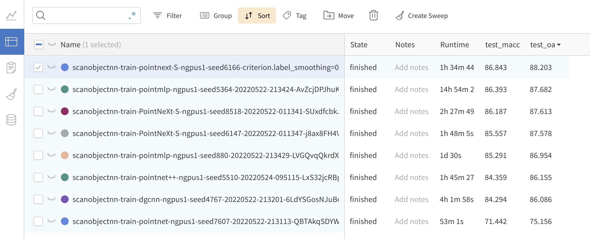

# Getting Started
## Weclome 

Welcome to [**OpenPoints**](https://github.com/guochengqian/openpoints) library. OpenPoints is a machine learning codebase for point-based methods for point cloud understanding. The biggest difference between OpenPoints and other libraries is that we focus more on reproducibility and fair benchmarking. 

1. **Extensibility**: supports many representative networks for point cloud understanding, such as *PointNet, DGCNN, DeepGCN, PointNet++, **ASSANet**, PointMLP, ***PointNeXt***, and **Pix4Point**. More networks can be built easily based on our framework since OpenPoints support a wide range of basic operations including graph convolutions, linear convolutions, local aggregation modules, self-attention, farthest point sampling, ball query, *e.t.c*.

2. **Reproducibility**: all implemented models are trained on various tasks at least three times. Mean±std is provided in the [PointNeXt paper](https://arxiv.org/abs/2206.04670).  *Pretrained models and logs* are available.

3. **Fair Benchmarking**: in PointNeXt, we find a large part of performance gain is due to the training strategies. In OpenPoints, all models are trained with the improved training strategies and all achieve much higher accuracy than the original reported value. 

4. **Ease of Use**: *Build* model, optimizer, scheduler, loss function,  and data loader *easily from cfg*. Train and validate different models on various tasks by simply changing the `cfg\*\*.yaml` file. 

   ```
   model = build_model_from_cfg(cfg.model)
   criterion = build_criterion_from_cfg(cfg.criterion_args)
   ```
   Here is an example of `pointnet.yaml` (model configuration for PointNet model):
   ```python
   model:
     NAME: BaseCls
     encoder_args:
       NAME: PointNetEncoder
       in_channels: 4
     cls_args:
       NAME: ClsHead
       num_classes: 15
       in_channels: 1024
       mlps: [512,256]
       norm_args: 
         norm: 'bn1d'
   ```

5. **Online logging**: *Support [wandb](https://wandb.ai/)* for checking your results anytime anywhere. 

   


## Install

### Pip packages

For Python import and checkpoint helper workflows:

```bash
pip install pointnext_official
```

`pointnext_official` depends on `openpoints`, provides PointNeXt metadata, and installs the `pointnext-download` checkpoint helper. These packages are importable without compiling CUDA extensions.

### Source install for training/evaluation

```bash
git clone --recurse-submodules https://github.com/guochengqian/PointNeXt.git
cd PointNeXt
git submodule update --init --recursive
source install.sh
```

If SSH is configured, `git clone --recurse-submodules git@github.com:guochengqian/PointNeXt.git` is equivalent.

Note:

1) The original `install.sh` assumes CUDA 11.3-era PyTorch/CUDA settings. If another CUDA version is used, modify `install.sh` accordingly; check your CUDA version with `nvcc --version` before using the bash file.

2) If the bash file does not work on your machine, read `install.sh` step by step and run the matching PyTorch/CUDA/operator build commands manually.

3) PointNeXt benchmark training/evaluation uses custom CUDA/C++ ops from the `openpoints` submodule. CPU-only and PyPI-only installs are fine for import/package smoke tests, but full benchmark reproduction requires a CUDA GPU and source-built ops.

4) For all experiments, we use wandb for online logging. Run `wandb --login` only the first time in a new machine. Set `wandb.use_wandb=False` to disable wandb. Read the [official wandb documentation](https://docs.wandb.ai/quickstart) if needed.


## General Usage 
All experiments follow the simple rule to train and test (run in the root directory): 

```
CUDA_VISIBLE_DEVICES=$GPUs python examples/$task_folder/main.py --cfg $cfg $kwargs
```

- $GPUs is the list of GPUs to use, for most experiments (ScanObjectNN, ModelNet40, S3DIS), we only use 1 A100 (GPUs=0)
  
- $task_folder is the folder name of the experiment. For example, for s3dis segmentation, $task_folder=s3dis

- $cfg is the path to cfg, for example, s3dis segmentation, $cfg=cfgs/s3dis/pointnext-s.yaml

- $kwargs is used to overwrite the default configs. E.g. overwrite the batch size, just appending `batch_size=32` or `--batch_size 32`.  As another example, testing in S3DIS area 5, $kwargs should be `mode=test --pretrained_path $pretrained_path`. 


## Model Profiling (FLOPs, Throughputs, and Parameters)

```
CUDA_VISIBLE_DEVICES=0 python examples/profile.py --cfg $cfg  batch_size=$bs num_points=$pts timing=True flops=True
```

For example, profile PointNeXt-S classification model as mentioned in paper:

- $cfg = cfgs/scanobjectnn/pointnext-s.yaml
- $bs = 128
- $pts = 1024