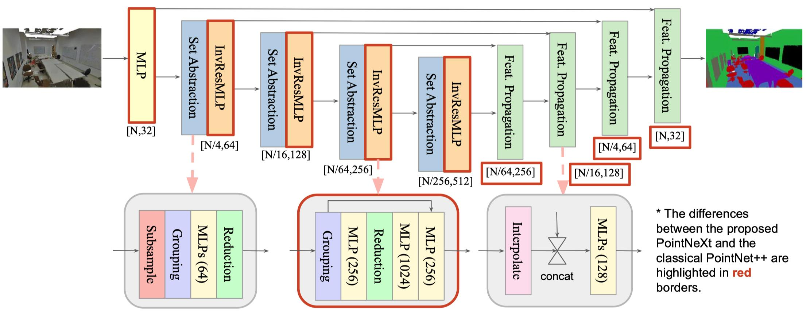

## PointNeXt: Revisiting PointNet++ with Improved Training and Scaling Strategies

*by [Guocheng Qian](https://www.gcqian.com/), [Yuchen Li](https://cemse.kaust.edu.sa/vision-cair/people/person/yuchen-li), [Houwen Peng](https://houwenpeng.com/), [Jinjie Mai](https://cemse.kaust.edu.sa/people/person/jinjie-mai), [Hasan Hammoud](https://cemse.kaust.edu.sa/ece/people/person/hasan-abed-al-kader-hammoud), [Mohamed Elhoseiny](http://www.mohamed-elhoseiny.com/), [Bernard Ghanem](https://www.bernardghanem.com/)*
<p align="center">

</p>


---
### [arXiv](https://arxiv.org/abs/2206.04670) | [OpenPoints Library](https://github.com/guochengqian/openpoints)

### News
-  :boom: Sep, 2022: [**PointNeXt**](https://arxiv.org/pdf/2206.04670v1.pdf) accepted by NeurIPS'22


### Abstract

PointNet++ is one of the most influential neural architectures for point cloud understanding. Although the accuracy of PointNet++ has been largely surpassed by recent networks such as PointMLP and Point Transformer, we find that a large portion of the performance gain is due to improved training strategies, *i.e.* data augmentation and optimization techniques, and increased model sizes rather than architectural innovations. Thus, the full potential of PointNet++ has yet to be explored. In this work, we revisit the classical PointNet++ through a systematic study of model training and scaling strategies, and offer two major contributions. First, we propose a set of improved training strategies that significantly improve PointNet++ performance. For example, we show that, without any change in architecture, the overall accuracy (OA) of PointNet++ on ScanObjectNN object classification can be raised from 77.9\% to 86.1%, even outperforming state-of-the-art PointMLP. Second, we introduce an inverted residual bottleneck design and separable MLPs into PointNet++ to enable efficient and effective model scaling and propose **PointNeXt**, the next version of PointNets. PointNeXt can be flexibly scaled up and outperforms state-of-the-art methods on both 3D classification and segmentation tasks. For classification, PointNeXt reaches an overall accuracy of $87.7\%$ on ScanObjectNN, surpassing PointMLP by $2.3\%$, while being $10 \times$ faster in inference. For semantic segmentation, PointNeXt establishes a new state-of-the-art performance with $74.9\%$ mean IoU on S3DIS (6-fold cross-validation), being superior to the recent Point Transformer.


### Visualization
More examples are available in the [paper](https://arxiv.org/abs/2206.04670).


---

### Citation
If you find PointNeXt or the OpenPoints codebase useful, please cite:
```tex
@InProceedings{qian2022pointnext,
  title   = {PointNeXt: Revisiting PointNet++ with Improved Training and Scaling Strategies},
  author  = {Qian, Guocheng and Li, Yuchen and Peng, Houwen and Mai, Jinjie and Hammoud, Hasan and Elhoseiny, Mohamed and Ghanem, Bernard},
  booktitle=Advances in Neural Information Processing Systems (NeurIPS),
  year    = {2022},
}
```
