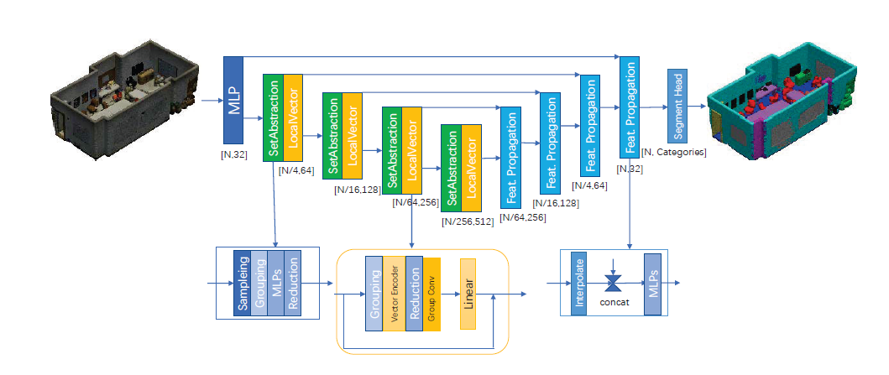
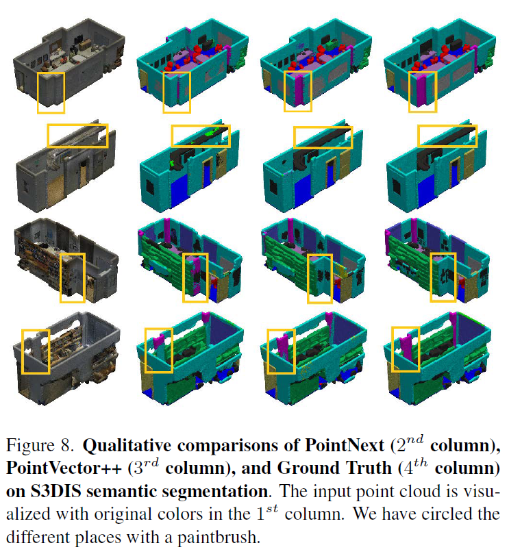

## PointVector: A Vector Representation In Point Cloud Analysis

*by [Xin Deng](https://xindeng98.github.io/), [WenYu Zhang](https://wenyu1009.github.io/), [Qing Ding](https://sse.ustc.edu.cn/2020/0422/c19861a418817/page.htm), [XinMing Zhang](http://staff.ustc.edu.cn/~xinming/)*
<p align="center">

</p>


---
### [arXiv](https://arxiv.org/pdf/2205.10528.pdf) 

### News
-  :boom: March, 2023: [**PointVector**](https://arxiv.org/pdf/2205.10528.pdf) accepted by CVPR'23


### Abstract

In point cloud analysis, point-based methods have rapidly developed in recent years. These methods have recently focused on concise MLP structures, such as PointNeXt, which have demonstrated competitiveness with Convolutional and Transformer structures. However, standard MLPs are limited in their ability to extract local features effectively. To address this limitation, we propose a Vector-oriented Point Set Abstraction that can aggregate neighboring features through higher-dimensional vectors. To facilitate network optimization, we construct a transformation from scalar to vector using independent angles based on 3D vector rotations. Finally, we develop a PointVector model that follows the structure of PointNeXt. Our experimental results demonstrate that PointVector achieves state-of-the-art performance $\textbf{72.3\% mIOU}$ on the S3DIS Area 5 and $\textbf{78.4\% mIOU}$ on the S3DIS (6-fold cross-validation) with only $\textbf{58\%}$ model parameters of PointNeXt. We hope our work will help the exploration of concise and effective feature representations. The code will be released soon.


### Visualization
More examples are available in the [paper](https://arxiv.org/pdf/2205.10528.pdf).




---

### Citation
If you find PointVector useful, please cite:
```tex
@misc{deng2023pointvector,
      title={PointVector: A Vector Representation In Point Cloud Analysis}, 
      author={Xin Deng and WenYu Zhang and Qing Ding and XinMing Zhang},
      year={2023},
      eprint={2205.10528},
      archivePrefix={arXiv},
      primaryClass={cs.CV}
}
```
